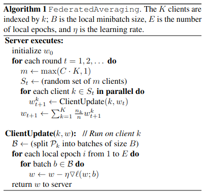
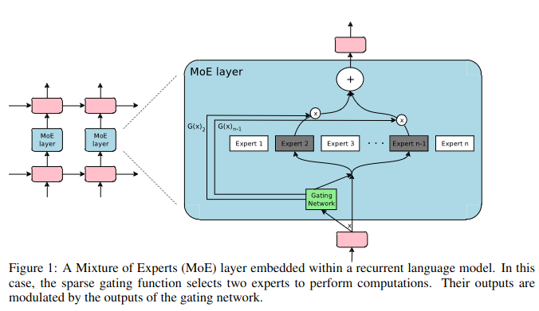

# FedAvg Algorithm
> Reference to [Related to Communication-Efficient Learning](https://zhuanlan.zhihu.com/p/619721874).    
 And you can click the
 [Eassy](https://proceedings.mlr.press/v54/mcmahan17a/mcmahan17a.pdf) to find the source to read.  
 I also browse the [video](https://www.bilibili.com/video/BV1Ke4y1r7ph/?spm_id_from=333.1007.top_right_bar_window_default_collection.content.click&vd_source=905b1a936b14f4596f66bae3f952df19) to help comprehend.

## Simple Introduction
在某些情况下，由于数据隐私和安全的原因，集中式训练模型可能不可行。这就是联邦学习的概念出现的原因。
联邦学习是一种机器学习范式，其中模型在本地设备上训练，而不是在集中式服务器上训练。

**FedAvg是一种常用的联邦学习算法，它通过加权平均来聚合模型参数。**

## Basic Thought
FedAvg的基本思想是将本地模型的参数上传到服务器，服务器**计算所有模型参数的平均值**，然后将这个平均值**广播回所有本地设备**。这个过程可以迭代多次，直到收敛。


### Algorithm Process


1. Server端**初始化全局模型参数 $w_0$**；
2. Server端**随机选择一部分Clients**，并在**Client计算本地模型参数 $w_i$**；
3. 选中的Clients上传本地模型参数 $w_i$ 到Server；
4. Server计算所有Client模型参数的**加权平均值 $\bar{w}$**，并**广播回到所有本地设备再次进行本地训练梯度下降**；

    ***注意加的权重大小取决于目前该Client的数据集占所有Client数据集的比重***
5. 所有本地设备采用 $\bar{w}$ 作为本地模型参数的初始值，重复步骤2~4，直到**全局模型收敛或指定做epoch轮次训练。**

### Code Realization

```python

def fedavg(self):
        # FedAvg with weight
        total_samples = sum(self.num_samples)
        base = [0] * len(self.weights[0])
        for i, client_weight in enumerate(self.weights):
            total_samples += self.num_samples[i]
            for j, v in enumerate(client_weight):
                base[j] += (self.num_samples[i] / total_samples * v.astype(np.float64))

        # Update the model
        return base
```

## Conclusion
    FedAvg算法是一种有效的联邦学习算法，能够在保护隐私数据的同时，利用本地数据训练全局模型，降低通信开销和支持分布式设备，同时提高模型的精度和泛化性能。
    
    
# One More Thing
> Reference to [初识MoE](https://blog.csdn.net/qq_36643449/article/details/123397350)   
[OUTRAGEOUSLY LARGE NEURAL NETWORKS:
THE SPARSELY-GATED MIXTURE-OF-EXPERTS LAYER](https://arxiv.org/pdf/1701.06538.pdf)

## 稀疏门控专家混合层（Sparsely-Gated Mixture-of-Experts Layer）
> It consists of millions of child-networks.(包括数以千计的前馈子网络)   

对于每一个样本，有一个可训练的门控网络（gating network）会计算这些专家（指前馈子网络）的稀疏组合。

MoE includes:
* 一些专家，每个专家都是一个简单的前馈神经网络
* 一个可训练的门控网络，它会挑选专家的一个稀疏组合，用来处理每个输入
* 所有网络都是使用反向传播联合训练的



### Comprehension
MoE层包括:
* n个“专家网络”: $E_1,\dots,E_n$.
* 一个门控网络$G$,其输出是一个稀疏的$n$维向量（对应$n$个专家）

给定输入$x$,定义$G(x)$是门控网络的输出；
$E_i(x)$是第i个专家网络的输出，于是MoE模块的输出：

$y=\displaystyle\sum_{i=1}^n G(x)_i E_i(x)$

基于$G(x)$的稀疏性，我们可以节省计算量。
* 当$G(x)_i = 0$时，我们无需计算$E_i(x)$
* 在我们的实验中，我们有**数以千计的专家**，但是针对每个样本，只需要用到**少量的专家**
* 另外，专家数目非常大，可使用**层次化的MoE**

***对于门控网络gate***
1. **Softmax Gating**

$Softmax(z_i)=\frac{e^{z_i}}{\textstyle\sum_{c=1}^C e^{z_c}}$ 

$G_\sigma(x)=Softmax(x\cdot W_g)$

但这种方法实际上是一种非稀疏的门控函数

2. **Noise Top-K Gating**

进行Softmax函数之前
* 加入**可调高斯噪声**,帮助**负载均衡（Load Balance）**
* **保留前k个值**,以**具有稀疏性**

